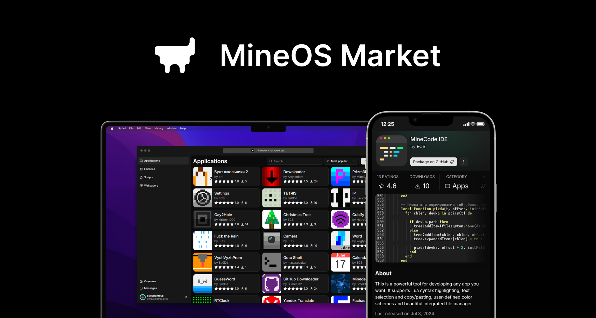

# [MineOS Market Web](https://mineos-market.vercel.com)

Frontend for [MineOS](https://github.com/IgorTimofeev/MineOS) Market built on Next.js and [mineos-market-js](https://github.com/dnrovs/mineos-market-js).

As there's no JS library or API for OCIF images to convert them, you will see placeholders only.